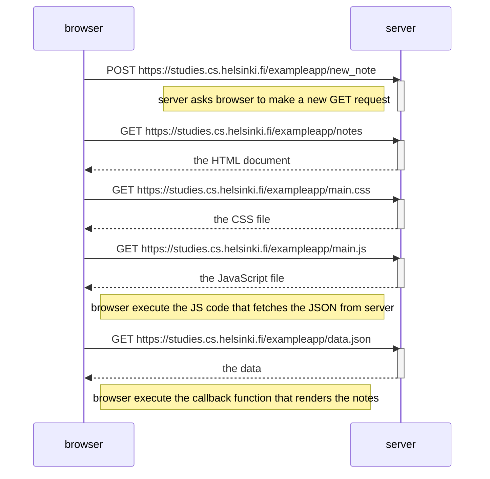

```mermaid
sequenceDiagram
    participant browser
    participant server

    browser ->> server: POST https://studies.cs.helsinki.fi/exampleapp/new_note
    activate server
    note left of server: server asks browser to make a new GET request
    deactivate server

    browser ->> server: GET https://studies.cs.helsinki.fi/exampleapp/notes
    activate server
    server -->> browser: the HTML document
    deactivate server

    browser ->> server: GET https://studies.cs.helsinki.fi/exampleapp/main.css
    activate server
    server -->> browser: the CSS file
    deactivate server

    browser ->> server: GET https://studies.cs.helsinki.fi/exampleapp/main.js
    activate server
    server -->> browser: the JavaScript file
    deactivate server
    note right of browser: browser execute the JS code that fetches the JSON from server

    browser ->> server: GET https://studies.cs.helsinki.fi/exampleapp/data.json
    activate server
    server -->> browser: the data
    deactivate server
    note right of browser: browser execute the callback function that renders the notes


```